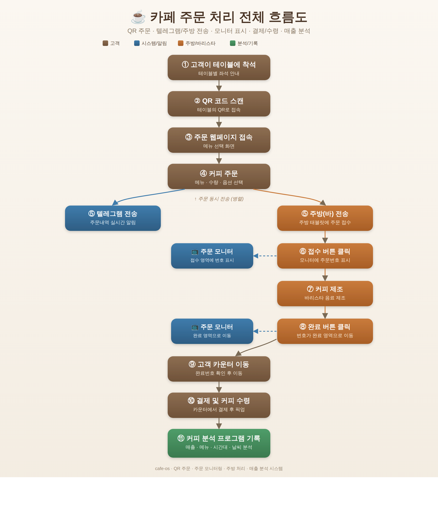
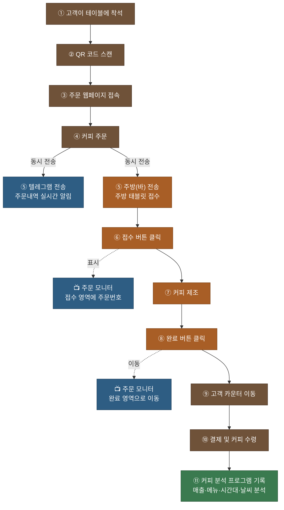

# 카페 주문 처리 전체 흐름도

손님 착석부터 매출 분석 기록까지 `cafe-os`의 전체 주문 처리 과정을 정리한 흐름도입니다.

> 이미지 원본: [`workflow.png`](workflow.png) · 벡터(SVG): [`workflow.svg`](workflow.svg)

## 처리 단계

1. **고객이 테이블에 착석** — 손님이 테이블에 앉습니다.
2. **QR 코드 스캔** — 테이블에 붙은 QR 코드로 접속합니다.
3. **주문 웹페이지 접속** — 주문 화면(메뉴)이 열립니다.
4. **커피 주문** — 메뉴·수량·옵션을 선택해 주문합니다.
5. **동시 전송 (병렬)**
   - **텔레그램 전송** — 주문 내역이 실시간 알림으로 전송됩니다.
   - **주방(바) 전송** — 주방 태블릿으로 주문이 접수됩니다.
6. **접수 버튼 클릭** — 주방에서 접수를 누르면 주문 모니터의 접수 영역에 주문번호가 표시됩니다.
7. **커피 제조** — 바리스타가 음료를 제조합니다.
8. **완료 버튼 클릭** — 완료를 누르면 주문번호가 모니터의 완료 영역으로 이동합니다.
9. **고객 카운터 이동** — 손님이 완료번호를 보고 카운터로 이동합니다.
10. **결제 및 커피 수령** — 카운터에서 결제 후 커피를 받습니다.
11. **커피 분석 프로그램 기록** — 매출·메뉴·시간대·날씨 데이터로 분석에 기록됩니다.

## Mermaid 소스 (편집용)

GitHub에서 아래 코드 블록은 자동으로 다이어그램으로 렌더링됩니다.

